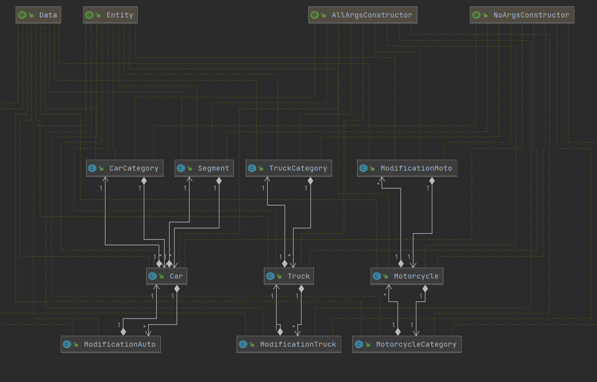
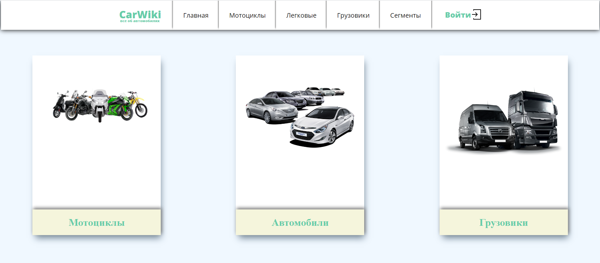
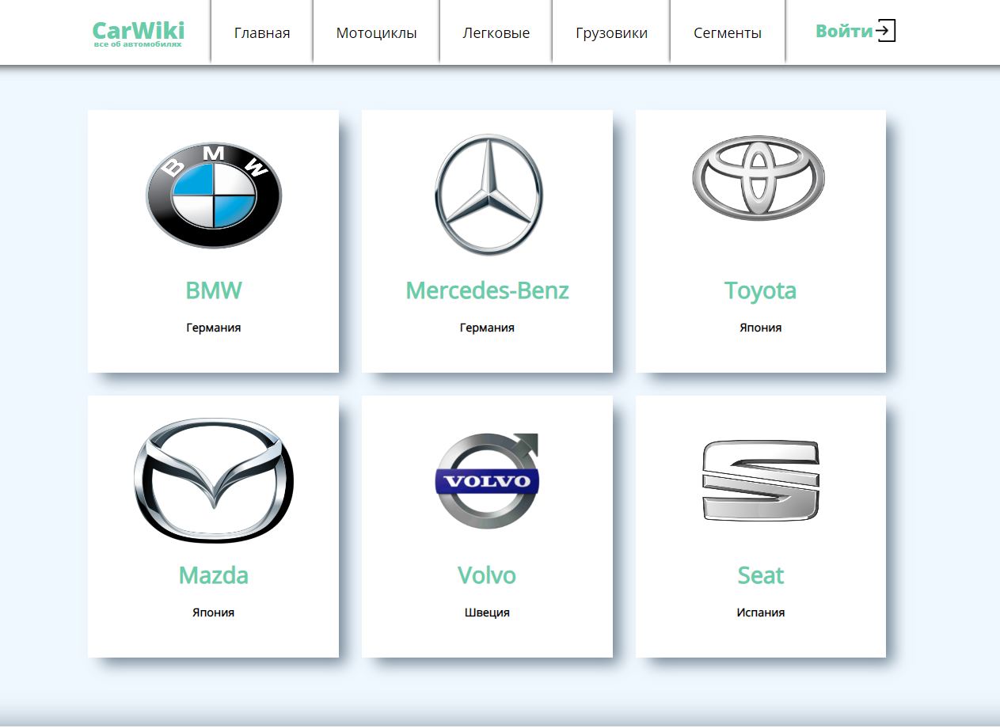
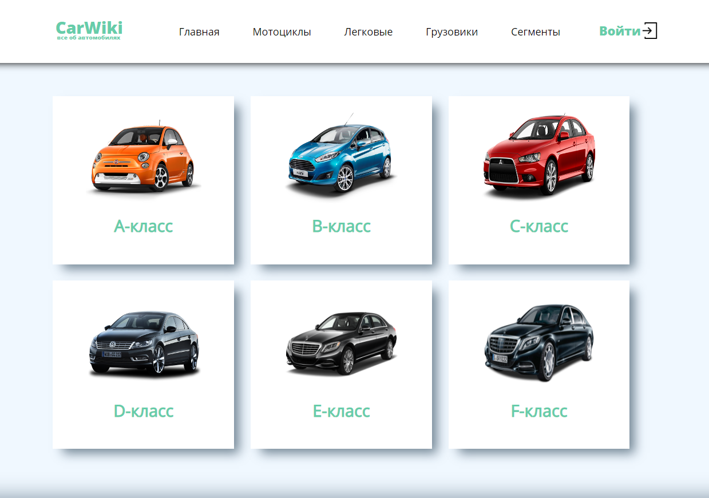
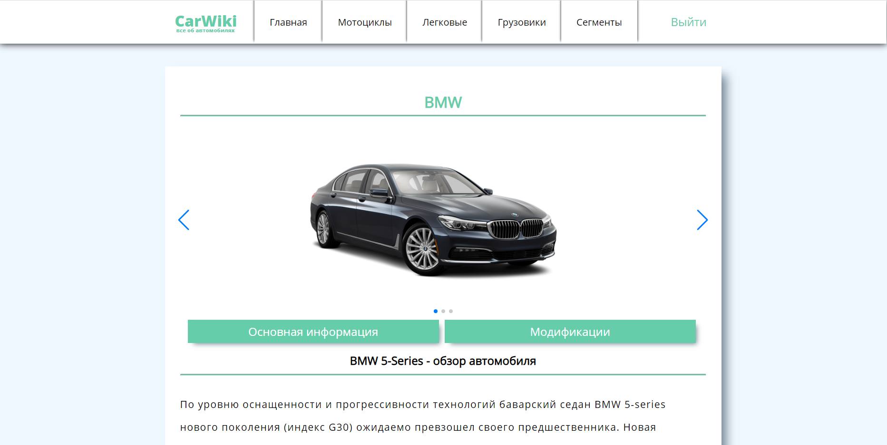
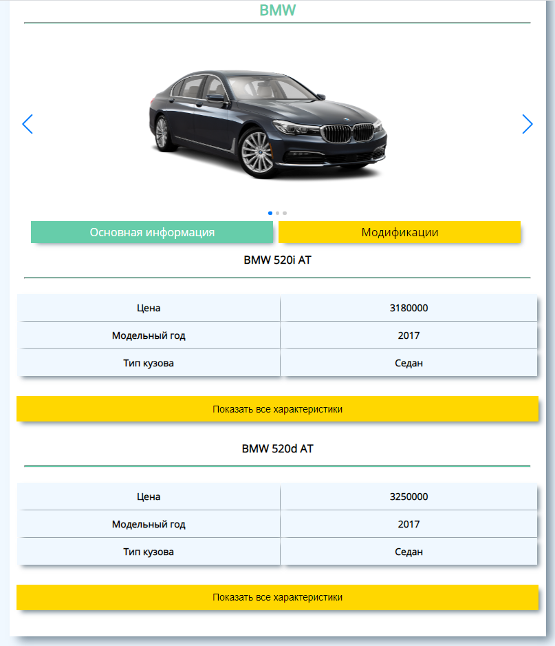

# CarList - Это проект с использованием Spring Boot,MVC,Security,Hibernate,Jpa,MariaDB,Thymeleaf
### Функционал приложения:
- Возможность регистрации новых пользователей
- Распределение ролей между пользователями(*Обычный пользователь*,*Администратор*)
- Создание новой марки(*Автомобиля*,*Мотоцикла*,*Грузовика*)
- Создание нового транспортного средства с привязкой к марке
- Создание новго класса автомобилей
- Создание новой модификации(*комплектации*) к автомобилю,мотоциклу или грузовику
- Просмотр страницы с выбранным транспортным средством  
- Возможность просмотреть список комплектаций

## Uml отображение моделей

### Главная страница
  
### Марки автомобилей

### Классы автомобилей

### Страница выбранного автомобиля

### Создание новой модификации

### Просмотр модификаций

### Загрузка проекта: 
* Клонируйте или скачайте проект 
`https://github.com/ScionRs/CarList.git`
### Backend  
* Запустите проект c помощью  `mvn spring-boot:run` или посредством нажатия клавиш Shift + F10

Возможность создавать/удалять новые автомобили и категории доступны только администратору.
