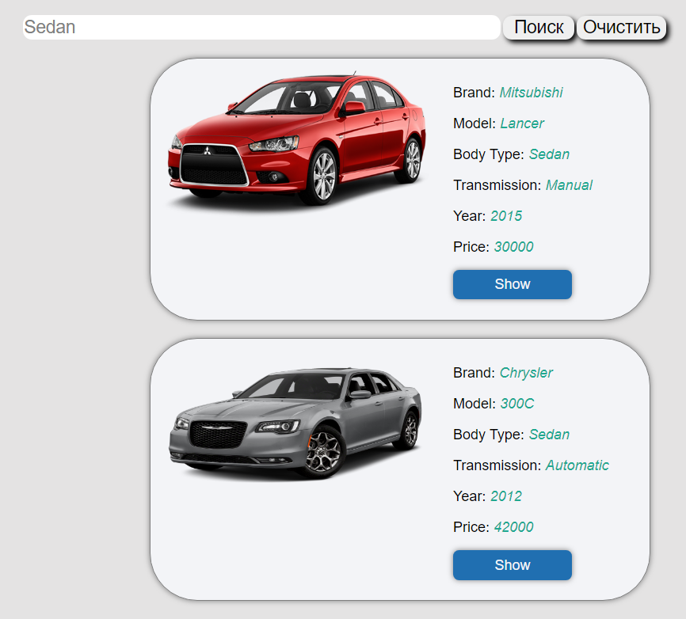
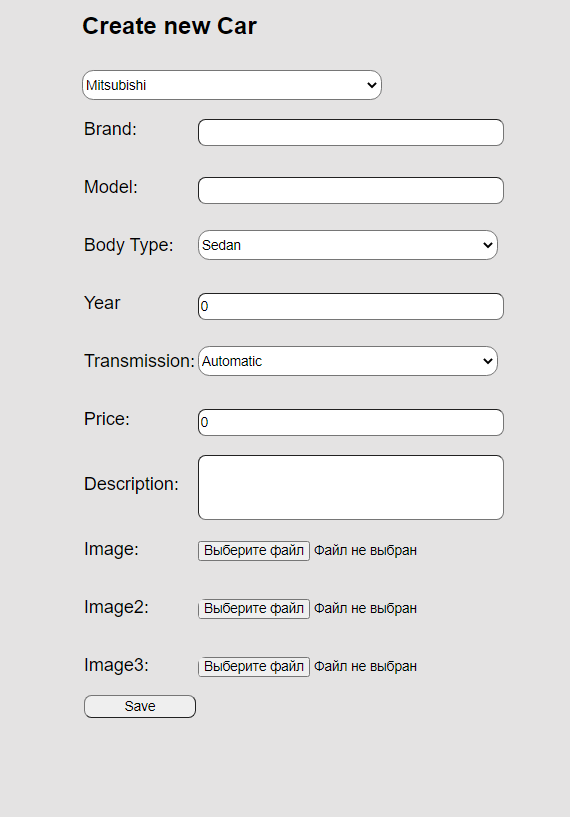

# CarList - Это учебный проект с использованием Spring Boot,MVC,Security,Hibernate,Data Jpa,MariaDB,Thymeleaf
### Функционал приложения:
#### Возможность регистрации новых пользователей
#### Распределение ролей между пользователями(Обычный пользователь,Администратор)
#### Добавление новых автомобилей и категорий
#### Просмотр страницы с выбранным автомобилем  
#### Удаление автомобилей из списка
#### Возможность осуществлять поиск по различным параметрам(Бренд,Модель,Тип кузова и тд)
#### Частичная локализация приложения

Краткая инструкция по запуску ->
1) Скачать проект
2) Импортировать базу данных(находится в проекте)
3) Настроить application.properties
4) Запустить

Для тех кому лень запускать проект:  
Главная страница

Поиск по различным параметрам
  
Добавление нового автомобиля    
  
Выбор категорий  
  
Просмотр выбранного автомобиля    
  

Возможность создавать/удалять новые автомобили и категории доступны только администратору.
