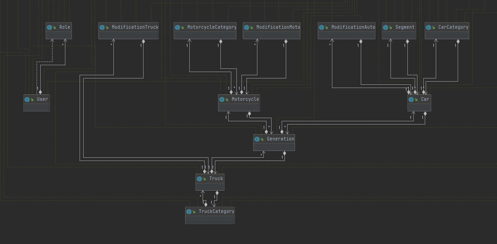
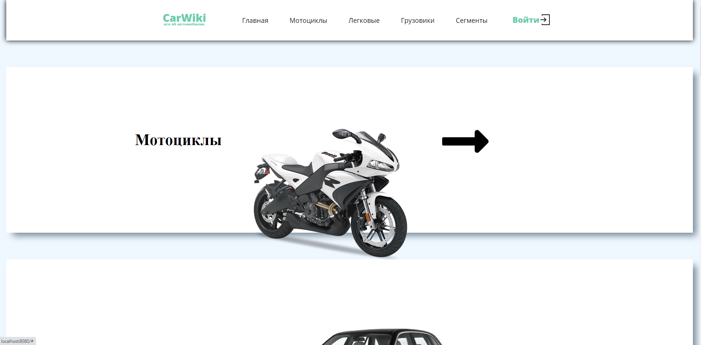
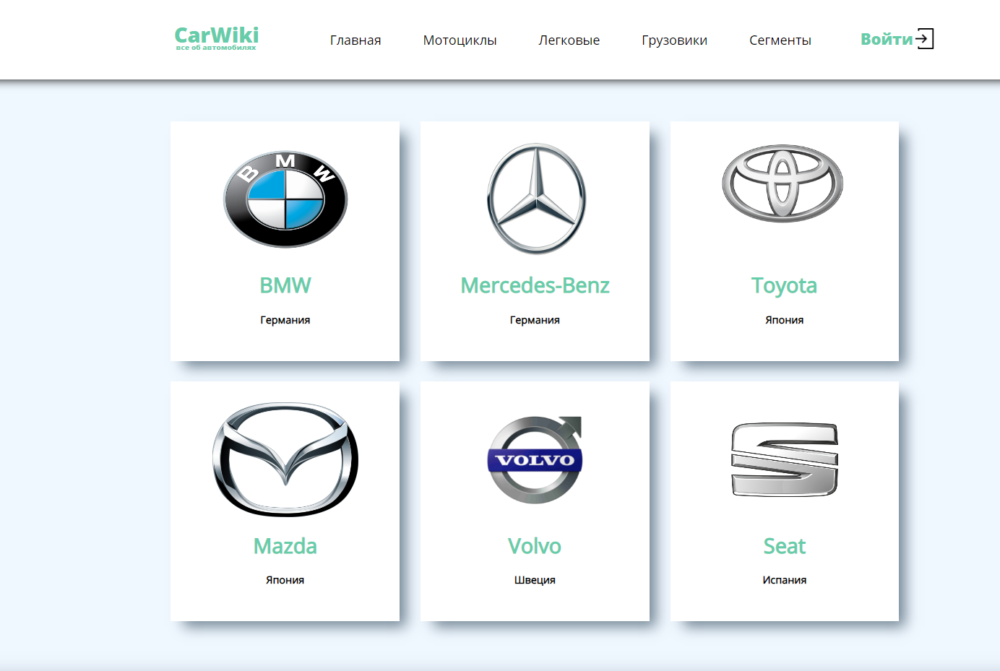
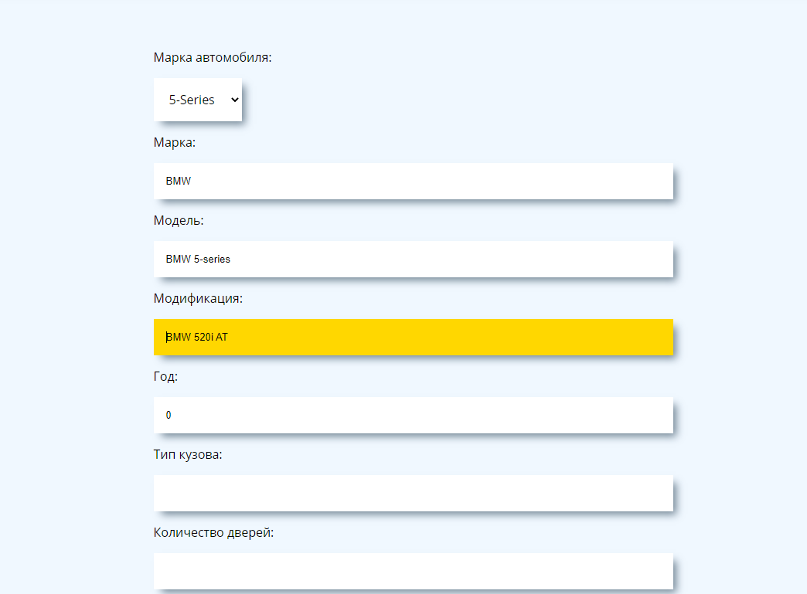

# CarList
CarList - Это Pet Project посвященный автомобильной тематике :car:  
Реализован при помощи Spring Framework
### Основные технологии :
 - Boot
 - WEB
 - Security
 - Hibernate
 - Jpa
 - MariaDB
 - Thymeleaf
### Функционал приложения:
- Возможность регистрации новых пользователей :man:
- Распределение ролей между пользователями(*Обычный пользователь*,*Администратор*)
- Создание новой марки(*Автомобиля*:car:,*Мотоцикла*:bike:,*Грузовика*:truck:)
- Создание нового транспортного средства с привязкой к марке
- Создание нового класса автомобилей
- Создание новой модификации(*комплектации*) к автомобилю:car:,мотоциклу:bike: или грузовику:truck:
- Просмотр предыдущих версий модели
- Поиск по автомобилям с помощью различных критериев :mag_right:
- Автоматический расчет расходов на содержание автомобиля(привязка к комлпектации) :moneybag::bar_chart:
- Просмотр страницы с выбранным транспортным средством  
- Возможность просмотреть список комплектаций

## Uml отображение моделей

### Главная страница

### Регистрация

### Марки автомобилей

### Классы автомобилей

### Страница выбранного автомобиля

### Создание новой модификации

### Просмотр модификаций

### Просмотр расходов

### Загрузка проекта: 
* Клонируйте или скачайте проект 
`https://github.com/ScionRs/CarList.git`
### Backend  
* Запустите проект c помощью  `mvn spring-boot:run` или посредством нажатия клавиш Shift + F10

Возможность создавать/удалять новые автомобили и категории доступны только администратору.
